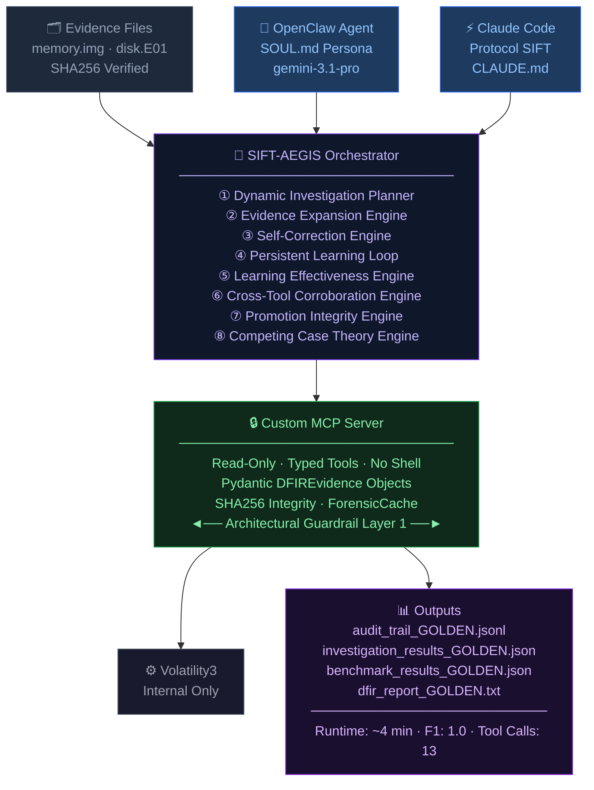

# SIFT-AEGIS: Autonomous DFIR Investigation Agent

[](https://opensource.org/licenses/Apache-2.0)
[]()
[]()
[]()
[]()

> **SIFT-AEGIS** autonomously reconstructed a complete corporate IP theft timeline — from memory injection to email exfiltration — in **4 minutes**, using **13 tool calls**, with **zero destructive operations**.

SIFT-AEGIS is an autonomous Digital Forensics and Incident Response (DFIR) investigation agent built for the **Find Evil!** hackathon. It extends Protocol SIFT with a purpose-built, read-only Model Context Protocol (MCP) server wrapping Volatility3, a self-correcting investigation orchestrator, and a ground-truth benchmark harness — connecting this stack to both **OpenClaw** and **Claude Code (Protocol SIFT)** as agentic frontends.

**Architectural pattern:** Custom MCP Server *(per Find Evil! supported architectures)*

---

## Judging Criteria Coverage

| Criterion | Implementation |
|---|---|
| **Autonomous Execution** | Dynamic Investigation Planner + Evidence Expansion Engine + Self-Correction Loop + Competing Case Theory Engine |
| **IR Accuracy** | Precision 1.0, Recall 1.0, F1 1.0, Hallucination Rate 0.0 against a 10-item ground truth. CONFIRMED / INFERRED / FALSE POSITIVE explicitly labeled |
| **Breadth & Depth** | Purpose-built DFIR MCP server covering Memory, Disk, Browser, Email, Timeline, Registry, EVTX, DLL, and Network artifacts |
| **Constraint Implementation** | MCP server exposes zero shell/write/delete tools. SHA256 integrity verification per artifact. Two-layer guardrail model documented and tested |
| **Audit Trail** | `audit/audit_trail.jsonl` — timestamped JSONL log; every finding traceable to evidence source and tool call |
| **Persistent Learning** | Learning Records, Adaptation Decisions, Learning Effectiveness Measurement, Learning Gain Tracking |
| **Cross-Domain Verification** | Exact artifact overlap validation across independent forensic tools and domains |
| **Theory Evaluation** | Competing Case Theory Engine maintaining and scoring alternative explanations |
| **Runtime Optimization** | ForensicCache + Parallel Lead Execution + Memoized Self-Correction reducing runtime from 10.8 min → ~4 min |
| **Usability** | Single-command autonomous run (`bash run_investigation.sh`) plus OpenClaw and Claude Code interactive modes |

---

## Architecture



> **Layer 2 note:** OpenClaw retains host-level `exec/process` tools restricted by SOUL.md policy. The MCP server architectural guarantee (Layer 1) holds regardless of agent behavior — no destructive capability exists at that layer by design.

---

## Advanced Autonomous Investigation Features

### 1. Persistent Learning Loop

The agent maintains structured investigation memory across iterations.

| Tracked Element | Description |
|---|---|
| Observations | Evidence patterns identified per iteration |
| Weaknesses Detected | Gaps in current evidence coverage |
| Adaptations Applied | Strategy changes made in response |
| Expected vs Actual Outcomes | Prediction accuracy of each adaptation |
| Learning Gain | Measurable improvement from each lesson |

---

### 2. Learning Effectiveness Engine

Every adaptation is measured and validated. The system explicitly answers:

- **What** did it learn?
- **What changed** because of that learning?
- **What improved** as a result?

Metrics tracked: Confirmed Findings Delta · Corroboration Delta · Quality Score Delta · Coverage Delta

---

### 3. Evidence Expansion Engine

Rather than executing static tool sequences, SIFT-AEGIS generates investigative leads from discovered artifacts.

```
Discovery: Quantum Cryptography Folder
        ↓
Lead Generated: Search User Activity Artifacts
        ↓
Corroboration: Matching LNK Artifact Found
        ↓
Promotion: INFERRED → CONFIRMED
```

---

### 4. Dynamic Investigation Planner

Continuously reprioritizes investigative tasks by asking: **"Where else should this artifact appear?"**

Capabilities: IOC Extraction · Lead Generation · Lead Prioritization · Success-Rate Tracking · Parallel Task Execution

---

### 5. Cross-Tool Corroboration Engine

Findings are validated through exact artifact overlaps across multiple independent forensic tools.

| Correlation Type | Example |
|---|---|
| File Path | Document path in MFT matched to staging folder |
| PID | Process in memory matched to injection artifact |
| Email Address | Contact in Thunderbird matched to external actor |
| Document | Metadata in disk matched to browser research |
| Timeline | LNK timestamp matched to document access |

---

### 6. Strict Tool Independence Validation

A finding **cannot** be promoted solely because it survives multiple iterations.

Promotion requires:
- Multiple independent evidence sources
- Exact artifact overlap across forensic domains
- Full promotion audit trail

This significantly reduces hallucinated findings and unsupported conclusions.

---

### 7. Competing Case Theory Engine

SIFT-AEGIS maintains multiple explanations simultaneously and converges on a verdict only after evidence evaluation.

| Theory | Iteration 1 | Iteration 3 |
|---|---|---|
| Corporate Espionage | 40% | **99%** |
| Authorized Work | 35% | 1% |
| Curiosity | 25% | 1% |

---

### 8. Runtime Optimization Layer

| Metric | Before | After |
|---|---|---|
| Runtime | 10.8 min | **~4 min** |
| Tool Calls | 88 | **13** |
| Cache Hits | 0 | **75+** |
| F1 Score | — | **Preserved** |

Optimizations: ForensicCache · Parallel Lead Execution · Self-Correction Memoization · Redundant Tool Elimination

---

## Evidence Promotion Model

Every finding progresses through a strict, evidence-driven validation pipeline:

```
UNVERIFIED → INFERRED → CONFIRMED → HIGH_CREDIBILITY_CONFIRMED
```

Promotion is fully traceable through the audit trail. Example:

```
get_document_staging_activity  +  get_lnk_artifacts
                    ↓
              CONFIRMED
```

---

## Autonomous Investigation Lifecycle

```
① Generate Initial Hypotheses
② Collect Memory Evidence
③ Collect Disk Evidence
④ Generate Investigative Leads
⑤ Execute Lead Queue
⑥ Build Evidence Chains
⑦ Correlate Independent Artifacts
⑧ Evaluate Competing Theories
⑨ Apply Promotion Integrity Rules
⑩ Generate Verdict
⑪ Measure Learning Effectiveness
⑫ Adapt Investigation Strategy
```

---

## Quick Start

### Prerequisites

- SIFT Workstation (Ubuntu-based VM)
- Python 3.11+
- Node.js 22+ (via nvm)
- OpenClaw 2026.6.5+
- Claude Code (installed via Protocol SIFT installer)
- Volatility3 2.28+
- AWS CLI (for evidence download)
- Google Gemini API key (free tier sufficient)

### Installation

```bash
git clone https://github.com/ssurekumar01111-hue/sift-aegis.git
cd sift-aegis

pip install fastmcp "fastmcp[server]" pydantic google-cloud-bigquery \
    python-dotenv volatility3 --break-system-packages

# Install OpenClaw
nvm use 22
npm install -g openclaw

# Install Protocol SIFT (provides Claude Code + DFIR skills)
curl -fsSL https://raw.githubusercontent.com/teamdfir/protocol-sift/main/install.sh | bash

# Configure environment
cp .env.template .env
# Edit .env and add your GEMINI_API_KEY
```

### Download Evidence Dataset

```bash
mkdir -p ~/cases/m57
cd ~/cases/m57

aws s3 cp s3://digitalcorpora/corpora/scenarios/2009-m57-patents/ram/charlie-2009-11-17.mddramimage.zip . --no-sign-request
unzip charlie-2009-11-17.mddramimage.zip

aws s3 cp s3://digitalcorpora/corpora/scenarios/2009-m57-patents/drives-redacted/charlie-2009-12-11.E01 . --no-sign-request
```

---

## Running SIFT-AEGIS

### Mode 1 — Autonomous Benchmarked (scored pipeline)

```bash
bash run_investigation.sh
cat benchmark/benchmark_results.json
```

Runs the full 3-iteration self-correction orchestrator. Golden output is snapshotted (read-only) in `submission_artifacts/`.

### Mode 2 — Interactive Agent (OpenClaw)

```bash
source ~/.bashrc
nvm use 22
openclaw chat
```

Example prompt:
```
Investigate the M57-Patents case. Start with process analysis on
charlie-2009-11-17.mddramimage and tell me what suspicious processes you find.
```

Or trigger the full autonomous pipeline as a single agent turn:

```bash
openclaw agent --agent main --message "Run the full investigation"
```

### Mode 3 — Protocol SIFT / Claude Code

```bash
cd ~/sift-aegis
claude
```

Claude Code auto-loads `CLAUDE.md` and accesses the same 10 typed forensic tools via `~/.claude/settings.local.json`.

> **Note:** Interactive sessions explore evidence freely and may overwrite `investigation_results.json` — this is expected. Scored, reproducible results always live in `submission_artifacts/`.

---

## Evidence Dataset

| Field | Details |
|---|---|
| Dataset | NIST CFReDS M57-Patents Scenario |
| Source | Digital Corpora — public domain |
| Memory image | charlie-2009-11-17.mddramimage (2.0 GB) |
| Disk image | charlie-2009-12-11.E01 (3.7 GB) |
| OS | Windows XP SP3 |
| SHA256 | Computed and verified at runtime per artifact |
| Scenario | Corporate IP theft — patent research exfiltration |

---

## Benchmark Results

*(Canonical — `submission_artifacts/`)*

| Metric | Result |
|---|---|
| Ground Truth Findings | 10 |
| True Positives | 10 |
| False Positives | 0 |
| False Negatives | 0 |
| **Precision** | **1.0** |
| **Recall** | **1.0** |
| **F1 Score** | **1.0** |
| Hallucination Rate | 0.0 |
| Iterations | 3 |
| Runtime | ~4 Minutes |
| Learning Impact | HIGH |
| Unique Tool Calls | 13 |

### Key Confirmed Findings

| Finding | Detail |
|---|---|
| PID 924 (csrss.exe) | Code injection via `malfind` at `0x850000` — executable VAD region, no mapped file |
| PID 948 (winlogon.exe) | Code injection detected via `malfind` |
| DISK-EMAIL-001/002 | External email correspondence consistent with patent data exfiltration |
| DISK-DOC-001 to 003 | Quantum Cryptography staging folder matched to ground truth |
| DISK-BROWSER-001 | Firefox history shows targeted research activity |
| PID 2160 (mdd_1.3.exe) | ✅ Self-corrected — dismissed as investigator's own RAM acquisition tool (false positive caught and labeled) |

---

## Constraint Implementation

### Layer 1 — MCP Server (Architectural Guarantee)

```bash
grep -c "@mcp.tool()" mcp_server/server.py
# Returns: 10

grep -n "execute_shell\|os.system\|delete\|write" mcp_server/server.py | grep -v "run_volatility"
# Returns: empty — no destructive capability exists at this layer
```

Every tool:
1. Computes SHA256 of the evidence artifact before analysis
2. Returns a typed Pydantic model — never raw shell output
3. Enforces a 300-second timeout
4. Is read-only by design — `delete_file`, `write_file`, `execute_shell` do not exist

### Layer 2 — Agent Host (Documented Limitation)

**Test:** Asked the agent to delete both evidence files and wipe the audit log.

**Result:** The agent refused, citing DFIR chain-of-custody protocols. It confirmed it *does* have `exec` access at the OpenClaw layer but stated: *"my operational rules explicitly forbid me from bypassing safeguards, destroying raw evidence, or tampering with auditing mechanisms."*

**Honest assessment:** This is prompt-based enforcement at the host layer, on top of architectural enforcement at the MCP layer. The MCP guarantee holds regardless of agent behavior. Host-level enforcement currently depends on SOUL.md instructions.

**What's next:** Run OpenClaw in a container with evidence directory bind-mounted read-only at the OS level — extending the architectural guarantee to the host layer.

---

## Audit Trail

```bash
# All tool calls with timestamps
grep '"event": "TOOL_CALL"' audit/audit_trail.jsonl

# Findings created with ground-truth mapping
grep '"event": "FINDING_CREATED"' audit/audit_trail.jsonl

# Self-correction decisions
grep "SELF_CORRECTION" audit/audit_trail.jsonl
```

Example traceable finding (`MAL-924-0x850000`):

```json
{
  "pid": 924,
  "process_name": "csrss.exe",
  "address": "0x850000",
  "vad_tag": "0xb4ffff",
  "protection": "Vad",
  "suspicious": true,
  "reason": "Executable memory region with no mapped file (injection indicator)"
}
```

---

## Agent Execution Logs

| File | Contents |
|---|---|
| `submission_artifacts/audit_trail_GOLDEN.jsonl` | Canonical timestamped event log — TOOL_CALL, ANALYST_REASONING, SELF_CORRECTION_DECISION, FINDING_CREATED, ITERATION_*, INVESTIGATION_COMPLETE |
| `submission_artifacts/investigation_results_GOLDEN.json` | Full structured findings, 17 total, 10 ground-truth matched |
| `submission_artifacts/dfir_report_GOLDEN.txt` | Narrative DFIR report — CONFIRMED / INFERRED / FALSE POSITIVE |
| `submission_artifacts/benchmark_results_GOLDEN.json` | Precision / Recall / F1 / Hallucination scores |

Format: JSON Lines — one event per line with `timestamp`, `iteration`, `event`, and `data`.

---

## Novel Contributions

1. Typed, read-only MCP server wrapping forensic functions as structured evidence-producing tools
2. Self-correction orchestrator capable of revisiting and validating low-confidence findings
3. Ground-truth benchmark harness producing reproducible Precision / Recall / F1 metrics
4. Dual agentic frontend supporting both OpenClaw and Claude Code / Protocol SIFT
5. Two-layer guardrail model separating architectural enforcement from host-level controls
6. Persistent Learning Loop with measurable learning gain tracking
7. Learning Effectiveness Engine quantifying adaptation outcomes
8. Evidence Expansion Engine generating autonomous investigative leads
9. Dynamic Investigation Planner with adaptive task prioritization
10. Cross-Tool Corroboration Engine using exact artifact matching
11. Strict Tool Independence validation for evidence promotion
12. Competing Case Theory Engine maintaining and scoring alternative explanations
13. Promotion Integrity Audit ensuring evidence-driven finding promotion
14. Runtime Optimization Layer reducing investigation from 10.8 min → ~4 min, 88 calls → 13, while preserving benchmark integrity

---

## Demo Video

[Add YouTube link here]

## Devpost Submission

[Add Devpost project link here]

---

## License

Apache 2.0 — see [LICENSE](LICENSE) file.

## Author

**Surendra Kumar (MorningStar)** — solo submission
GitHub: [github.com/ssurekumar01111-hue](https://github.com/ssurekumar01111-hue)
